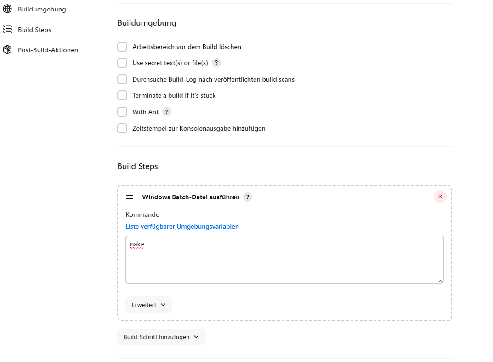
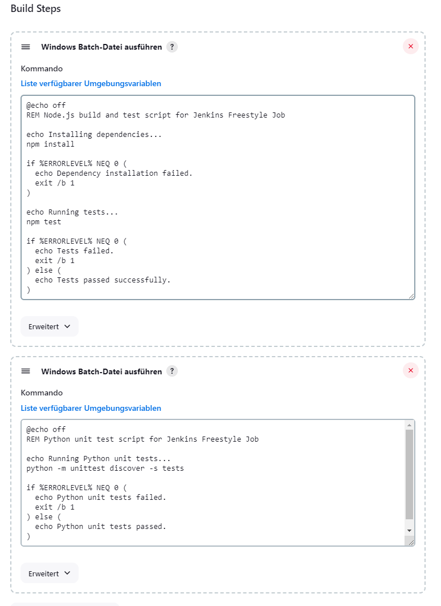
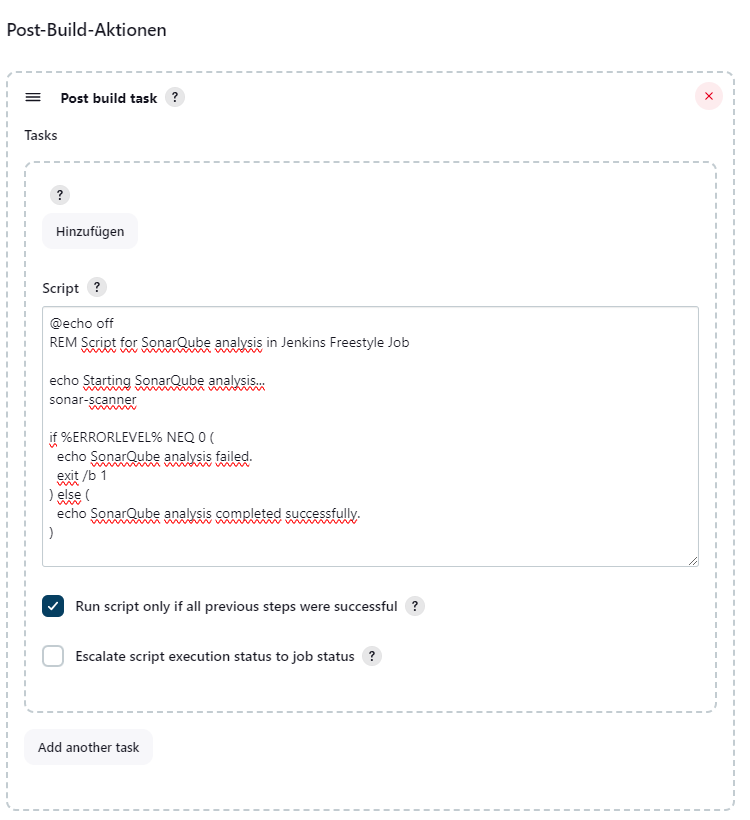
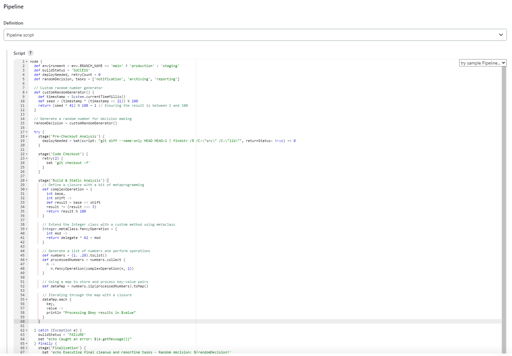
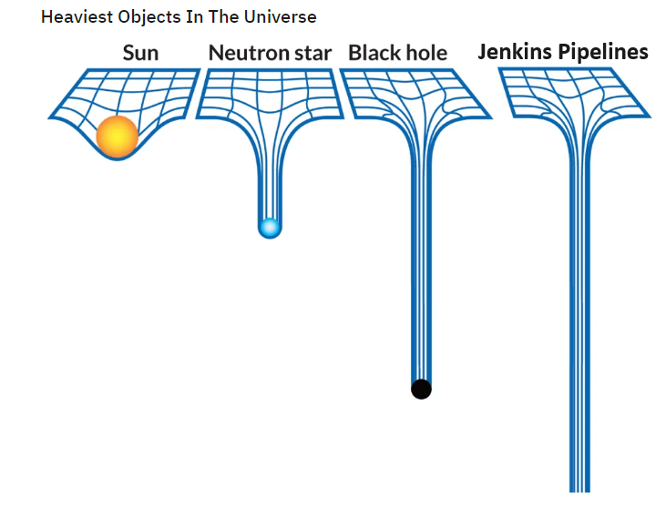

## Weniger Pipelines, Mehr Spaß!?

<div style="font-size: 0.7em;">
Rhein-Main Testing Day 2025 in Eschborn
</div>

Notes:

- Hallo zusammen und willkommen zur Open Space Diskussion über meine These "Weniger Pipelines == Mehr Spaß!".

---

## Wer bin ich?

<div class="fragment">
    
    <br>
    <a href="https://www.linkedin.com/in/karnangue/">Karsten</a>
</div>

--

### Was ist meine Agenda?

- <!-- .element: class="fragment" --> Tue Gutes ...
  - <!-- .element: class="fragment" --> Jenkins in Automotive/Embedded-C
  - <!-- .element: class="fragment" --> Unsere Pipelines und Quality Gates
- <!-- .element: class="fragment" --> ... und rede darüber!

---

## Wo komme ich her?

Back to 2005 <!-- .element: class="fragment" data-fragment-index="1" -->

 <!-- .element width="50%" class="fragment" data-fragment-index="1" -->

Note:

- Dazu geht es etwas zurück in die Vergangenheit, genauer gesagt ins Jahr 2005.

- Da hab ich als Neuling in der Automobilindustrie angefangen.

--

### Der Job

- <!-- .element: class="fragment" --> SW-Entwicklung für Bremsensteuergeräte
- <!-- .element: class="fragment" --> Embedded C? Das hatten wir doch an der Uni!
- <!-- .element: class="fragment" --> Es ist dein Code, aber verändere bloß nichts!
- <!-- .element: class="fragment" --> Always remember: don't break the build!
- <!-- .element: class="fragment" --> Dem Ingenieur ist nix zu schwör!

Note:

Und der Job?

- Hacken Embedded C für Bremsensteuergeräte

- Kein Problem, das hatten wir doch an der Uni.

- Man bekam Verantwortung für einen Teil des Codes, aber verändern sollte man ihn möglichst nicht.

- Warum? Don't break the build!

- Klang schwierig, aber wir hatten ja an der Uni gelernt: Dem Ingenieur ist nix zu schwör!

--

### Die Ausgangslage

- Keine Unit Tests <!-- .element: class="fragment" -->
- Kein CI, nur nightly builds <!-- .element: class="fragment" -->
- Viele Integrationstests, hauptsächlich Fahrversuch <!-- .element: class="fragment" -->
- Code Reuse über alle Projekte <!-- .element: class="fragment" -->
- Mehrere 100 Entwickler weltweit an einer Codebasis <!-- .element: class="fragment" -->

Note:

Die Ausgangslage?

*click*

Oha, keine Unit Tests.

Keine einige Zeile Testcode im Repository.

Klar, wo testet man Bremsen? Im Auto.

*click*

Gut, es wurde ein bisschen SIL und HIL gemacht.

*click*

Aber das meiste wurde im Fahrversuch getestet.

Viele Features waren also irgendwann, irgendwo in irgendeinem Projekt getestet.

Daher das Motto: besser nichts ändern.

*click*

Aber wie soll das gehen, wenn der Code über alle Projekte geshared ist,

alle Kunden mit neuen Anforderungen um die Ecke kommen ..

*click*

und mehrere 100 Entwickler weltweit an einer Codebasis arbeiten?

--

### Der Traum: eine SW Factory

 <!-- .element height="60%" width="60%" -->

--

### Jenkins School of Witchcraft and Wizardry

 <!-- .element height="60%" width="60%" -->

Note:

- Die Krux mit den Jenkins Pipelines
  - Java-Entwickler, die einfach Java programmieren wollen
  - Und es dann nicht dürfen!
  - Viele Missverständnisse, was wo ausgeführt wird
  - Keiner versteht mehr, wie die Pipeline funktioniert.
  - Keiner kann debuggen.
  - Keiner kann es nachvollziehen.
  - Anti-Pattern von CI.
- 2 Scrum Teams waren zu wenigstens 50% mit Maintenance ausgelastet.
- Es ging die "Service Card" um.

--

### Freestyle Happiness

 <!-- .element width="80%" -->

Note:

Klar, wenn man mit Jenkins startet, geht es mit einfachen freestyle jobs los.

Einfach nur bauen.

--

### Freestyle Faith

<div style="position:relative; width:900px; height:600px; margin:0 auto;">
    
    
</div>

Note:

- dann passiert plötzlich doch ein bisschen mehr
- nach und nach müssen Tools zusammengeklebt werden
- Anbindung ans SCM System
- Reporting

--

### Holy Moly Groovy Pipelines

 <!-- .element width="80%" -->

--

 <!-- .element width="65%" -->

Note:
Höher, schneller, weiter: Eine Pipeline, um sie alle zu knechten.

--

### Law of the Instrument

- <!-- .element: class="fragment" --> Pipeline als Ersatzbuildsystem
- <!-- .element: class="fragment" --> Buildlogik in Pipelines (10000e Zeilen Groovy DSL)
- <!-- .element: class="fragment" --> Ausreichend? Nein! Shared Libraries und Plugins gibt es ja auch noch ...
- <!-- .element: class="fragment" --> Nicht nachvollziehbare CI Ergebnisse
- <!-- .element: class="fragment" --> Worst case: getrennte Repos für Produkt und Pipelines

Note:

- CI-System macht andere/mehr Sachen als die Buildumgebung.
- Mit dem Hammer in der Hand sieht die Welt wie ein Haufen von Nägeln aus.
- Birmingham screwdriver

--

### Continuous Complexity

 <!-- .element width="60%" style="filter: invert(100%)" -->

---

## Wo will ich hin?

- <!-- .element: class="fragment" --> Pipeline as Code
- <!-- .element: class="fragment" --> Dependencies as Code
- <!-- .element: class="fragment" --> Quality Checks as Code
- <!-- .element: class="fragment" --> Everything else as Code

Note:

--

### Pipeline Happiness?

- Checkout vom Repository<!-- .element: class="fragment" -->
- Installation aller Abhängigkeiten <!-- .element: class="fragment" -->
- Ausführen ausgewählter Tests als Quality Checks <!-- .element: class="fragment" -->
- Archivieren der Ergebnisse <!-- .element: class="fragment" -->

--

### Jenkins

<div style="font-size: xx-large">

``` Groovy
...

node() {
    stage("Checkout Code") {
        checkout scm
    }

    stage("Installation of Dependencies") {
        bat "call build.bat -install -installOptional || exit /b 1"
    }

    stage ("Execute Tests") {
        bat "call build.bat -selftests -marker 'build_debug or reports' || exit /b 1"
    }

    stage("Deploy Test Results") {
        junit allowEmptyResults: false, keepLongStdio: false, testResults: "test/output/test-report.xml"
    }

    ...
}

...
```

</div>

--

### GitHub Actions

<div style="font-size: xx-large">

``` yaml
...

jobs:
  test:
    name: CI Gate
    runs-on: windows-latest

    steps:
      - name: Checkout Code
        uses: actions/checkout@v4
        with:
          fetch-depth: 0
      - name: Installation of Dependencies
        run: |
          .\build.ps1 -install
        shell: powershell
      - name: Execute Tests
        run: |
          .\build.ps1 -selftests -marker "build_debug or reports"
        shell: powershell
      - name: Deploy Test Results
        uses: EnricoMi/publish-unit-test-result-action/windows@v2
        if: always()
        with:
          files: |
            test/output/test-report.xml

...
```

</div>

---

### ... und redet darüber!

- Feedback welcome!
- Ich hab gehört, Jenkins ist tot! Wirklich?
- Wie sehen eure Pipelines so aus?
- Habt ihr Spaß mit CI?

---

 <!-- .element height="40%" width="40%" -->
https://xxthunder.github.io/RheinMainTestingDay2025/
